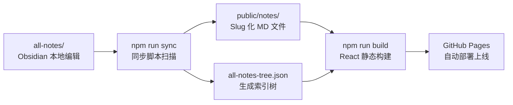

# 🖥️ Front-End-Notes

> **「写给未来自己的技术手册」** —— 一份同时活在 Obsidian 和 Web 上的个人知识库

<p align="center">
  
  
  
  
</p>

---

## ✨ 项目特色

这不是一个普通的笔记仓库 —— 它是一套**「双模式知识库工作流」**：

- 📝 **本地编辑**：直接用 [Obsidian](https://obsidian.md/) 打开，享受原生双向链接、本地搜索、快速笔记体验
- 🌐 **在线展示**：一键同步构建，自动发布为美观的静态网站，分享给任何人
- 🎨 **复古终端美学**：CRT 扫描线 + 霓虹色调 + Three.js 3D 背景，独特阅读体验
- 🔄 **全自动流程**：编辑笔记 → 提交 → 自动同步构建 → 自动部署，一切行云流水
- 📊 **系统化整理**：从前端到后端，循序渐进的知识体系，而非零散碎片

## 🚀 在线预览

🔗 **点击访问**：https://yzyz-bit.github.io/Front-End-Notes/


## 📁 目录结构

```
Front-End-Notes/
├── all-notes/              # 🔖 笔记源文件 (在这里用 Obsidian 编辑)
│   ├── 前端/              # JavaScript / React / Vue
│   ├── 后端/              # Go / Java
│   ├── Nest/              # NestJS 全栈框架
│   ├── 📝Notes/           # 计算机网络 / 零散知识点
│   ├── 开发经验/           # 实战总结与架构思考
│   └── ...
├── scripts/
│   └── sync-notes.js      # 🔄 同步脚本：生成索引 + 转换 slug
├── src/                    # ⚛️ React 网站源码
│   ├── components/        # 布局 / 导航 / 渲染 / 3D背景
│   ├── pages/             # 首页 / 列表 / 详情 / 404
│   └── styles/            # 复古 CRT 样式
├── public/                 # 静态资源 (同步输出)
│   ├── notes/             # slug 化的 md 文件
│   └── all-notes-tree.json # 自动生成的笔记索引树
├── .obsidian/             # Obsidian 配置 (已忽略构建目录)
├── .github/workflows/
│   └── deploy.yml         # 🚀 GitHub Actions 自动部署
└── vite.config.js         # Vite 配置
```

## 🛠️ 工作原理

### 「一份内容，两种用途」的核心 workflow



**本地使用**（记笔记）:
1. 用 Obsidian 打开项目根目录
2. 在 `all-notes/` 下创建/编辑 Markdown 笔记
3. Obsidian 已经配置好忽略 `node_modules/` `dist/` `public/` 等目录，只看得到笔记

**网站构建**（发布）:
```bash
# 安装依赖
npm install

# 同步笔记 + 启动开发服务器
npm run dev

# 同步笔记 + 生产构建
npm run build
```

**自动部署**:
- 推送到 `main` 分支自动触发 GitHub Actions
- 执行 `npm ci → npm run sync → npm run build`
- 自动部署到 GitHub Pages

## 📚 笔记内容统计

| 分类 | 笔记数 | 内容 |
|------|--------|------|
| **前端** | 28 | JavaScript (13) · React (7) · Vue (7) |
| **后端** | 39 | Go (24) · Java (15) |
| **NestJS** | 20 | 完整学习路径从入门到部署 |
| **📝Notes** | 16 | 计算机网络 · React 专题 · 原生JS |
| **开发经验** | 8 | 架构思考 · AI辅助开发 · 性能优化 |
| **工具收集** | 4 | 实用代码片段 · 优质链接收藏 |
| **总计** | **116+** | 系统化技术知识库 |

## 🎨 技术栈

- **框架**: React 18 + Vite
- **路由**: React Router v6 (Hash 路由，适配 GitHub Pages)
- **Markdown 渲染**: react-markdown + remark-gfm
- **代码高亮**: react-syntax-highlighter (VSCode Dark+)
- **3D 背景**: Three.js
- **部署**: GitHub Pages + GitHub Actions

## 🌟 为什么这么做？

作为开发者，我们都需要一个地方整理沉淀自己的知识：

1. **Obsidian** 是最好的本地笔记工具，双向链接、本地优先、快速干净
2. 但把笔记公开分享时，需要一个比 GitHub 浏览更好看的阅读体验
3. 不想维护两份内容 —— 「一份源码，两处部署」是最优雅的解决方案

这套方案已经在实际使用中验证，自动化程度高，维护成本几乎为零。

## 📖 如何克隆使用

如果你喜欢这种双模式笔记工作流，可以直接 fork 这个仓库：

```bash
# 克隆
git clone https://github.com/你的用户名/Front-End-Notes.git
cd Front-End-Notes

# 安装依赖
npm install

# 在 all-notes/ 放入你的笔记
# 用 Obsidian 打开项目根目录开始编辑

# 本地预览
npm run dev

# 开启 GitHub Pages 在仓库设置
# 推送后自动部署 ✨
```

## 💡 项目建议

基于对项目结构和当前实现的分析，这里有一些改进建议供参考：

### 1. **功能增强**
- [ ] **搜索功能**：添加全文搜索，方便在 100+ 笔记中快速定位
- [ ] **标签系统**：利用 YAML frontmatter 的 tags 实现标签云、标签筛选
- [ ] **返回顶部按钮**：长阅读后快速返回导航
- [ ] **暗色/亮色主题切换**：照顾不同阅读习惯

### 2. **用户体验**
- [ ] **目录侧边栏**：单篇笔记内生成标题目录，长文跳转方便
- [ ] **最近更新**：在首页显示最近修改的笔记（可由同步脚本自动生成）
- [ ] **阅读进度条**：顶部显示阅读进度
- [ ] **复制代码按钮**：代码块一键复制

### 3. **性能优化**
- [ ] **代码分割**：按路由分割，减小首屏体积
- [ ] **图片懒加载**：笔记中图片延迟加载
- [ ] **静态生成预渲染**：可考虑使用 SSG（Next.js/Astro）预渲染所有笔记，利于 SEO

### 4. **内容体验**
- [ ] **添加更多截图**：README 和首页展示网站实际效果
- [ ] **RSS 订阅**：生成 RSS feed 方便订阅更新
- [ ] **笔记字数统计**：在列表显示估计阅读时间

## 📝 许可证

个人知识分享，随意使用，欢迎交流 ⭐

---

<div align="center">
  <i>Happy Coding & Happy Note-Taking ✍️</i>
</div>
